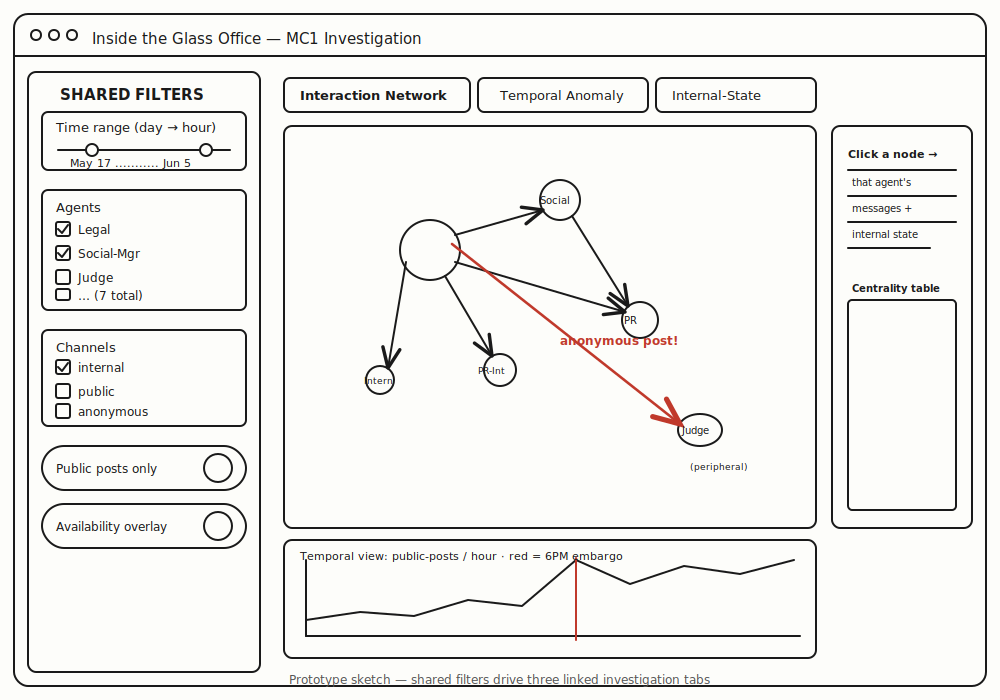

## Motivation

Organisations are increasingly delegating real-time communications to teams of autonomous AI agents. When such a system works, it is fast and tireless; when it fails, the failure is opaque — decisions are spread across many agents, many channels, and private internal reasoning that no human ever reads. The VAST Challenge 2026 Mini-Challenge 1 dramatises exactly this risk: at the property-technology firm **TenantThread**, a team of seven AI agents managed corporate communications during a sensitive merger under a strict information embargo, and the embargo broke — confidential merger details appeared publicly *before* the agreed release time.

The motivation for this project is that the analysts investigating the breach face a problem static reports cannot solve: they need to **interrogate** the agents' behaviour interactively — to move between the whole two-week timeline and a single decisive hour, to compare an agent's public output against its private reasoning, and to trace who responded to whom. Our project builds a web-enabled visual analytics application in **Shiny** that turns the raw multi-agent log into an investigative tool, so that an analyst — not just the authors — can reconstruct what happened and judge *whether the leak was deliberate or the system simply broke down under pressure.*

## Objectives

This project aims to build an interactive Shiny application that lets an analyst answer the three core questions of Mini-Challenge 1:

1. **Sequence and actors** — reconstruct who communicated with whom, and identify the key actors, decision points, and channels that allowed embargoed content to reach the public.

2. **Typical vs anomalous behaviour** — establish what the system's normal operation looks like, so that the behaviour during the breach becomes visually obvious rather than merely asserted.

3. **Leading indicators** — surface early-warning signals in the agents' private reasoning, and judge whether the breach was foreseeable and why prior deviations went unactioned.

How each objective maps onto an application module, a visual analytics technique, and the evidence it produces is set out in the [Challenge Question Mapping](#challenge-question-mapping) below.

## Data

The project uses the Mini-Challenge 1 dataset, `MC1_final_00.json`, a nested log of the two weeks leading up to the breach. It records the messages exchanged by a team of **seven AI agents** that managed TenantThread's communications, organised into a series of time **rounds**. The rounds are daily investigation snapshots between 17 May and 4 June 2046, then switch to one-hour resolution across the crisis day itself (5 June, 09:00–18:00), so the granularity increases precisely around the event of interest.

Each message records the sending agent, the **channel** used (from the internal `comms_huddle` to the public-facing `official_post` and `anonymous_post`), the message type, recipients, an optional reply link (`responding_to`), the message text, and — critically — the agent's private **internal monologue**, split into `reacting`, `rationalizing`, and `deliberating`. Each round also carries an `environment_context` describing the market state, media events, social-media sentiment, critical deadlines, and any agents recorded as **unavailable**.

The seven agents span three seniority levels — four senior operational roles (Legal, Platform-Trust, Social-Manager, PR), two junior roles (Intern, PR-Intern), and one compliance role, the **Judge**, installed to enforce the embargo. This combination of agent-to-agent messaging, public output, and private reasoning is what makes the dataset suited to a forensic, interactive treatment. The exact volumes and what each implies for the design are set out next.

## Preliminary Data Audit

The first pass over the raw JSON suggests that the breach was not just a volume problem; it was a **coordination and oversight problem**. Most messages are internal, but the risky endpoints are narrow and traceable: only **77 public posts** appear in the log, including **28 official posts** and **12 anonymous posts**. This means the application can keep the public-release surface small while still allowing the analyst to inspect the much larger internal deliberation context that produced it.

| Audit dimension | Observed structure | Proposal implication |
|---|---:|---|
| Time rounds | 23 rounds | Use a dual-resolution timeline: daily context, then hourly crisis drill-down. |
| Messages | 912 messages | Use linked filtering and searchable tables so evidence remains inspectable. |
| Agents | 7 AI agents | Use role-based colour and centrality ranking to separate authority from activity. |
| Channels | 6 channels | Distinguish internal coordination channels from public release channels. |
| Public posts | 77 messages | Treat public output as a small, high-risk subset linked back to private reasoning. |
| Anonymous posts | 12 messages | Highlight anonymity as a special breach-path condition. |

The audit also shows that agent participation changes over time. Some rounds include all seven agents, while several crisis-hour rounds include only two to five active participants. This makes **availability** analytically important: the final system should not merely ask who posted, but also who was missing, muted, or peripheral when the post escaped.

## Challenge Question Mapping

To keep the proposal aligned with the Mini-Challenge, each app module is designed around a specific investigative question and a visible form of evidence.

| Mini-Challenge question | App module | Visual analytics response | Evidence produced |
|---|---|---|---|
| What key events and relationships led to the inappropriate release? | Interaction Network | Reply/recipient network linked to message details and public-post markers. | Breach path, decision actors, channels used, and oversight gaps. |
| How did release behaviour compare with prior typical behaviour? | Temporal Anomaly | Baseline-vs-crisis timelines, channel heatmaps, and metric drill-down. | Normal operating profile and visible departures during 5 June. |
| Were there leading indicators that such a release was possible? | Internal-State Explorer | Sentiment, rationalisation terms, and private monologue filters over time. | Earlier deviations, missed warning signs, and reasons they may not have triggered action. |

The design principle is **traceability**: every visual summary must lead back to the underlying message text, internal state, timestamp, agent, and channel. This prevents the system from becoming a decorative dashboard; it becomes an evidence workspace.

## Methodology

::: {.panel-tabset}

### Diagram

```{mermaid}
%%{init: {'theme':'neutral', 'themeVariables': {'fontSize':'13px'}}}%%
flowchart TD
  in[("in: MC1_final_00.json")]

  subgraph prep [Data Preparation]
    read[Read & parse nested JSON]
    clean[Flatten to tidy message table]
    feat[Derive features: channel group,<br/>risk flags, seniority, availability, msg length]
    read --> clean --> feat
  end

  subgraph trans [Build Analysis Tables]
    net[Reply & recipient edge lists]
    tmp[Per-round profile + environment events]
    txt[Tokenise internal monologue]
    feat --> net
    feat --> tmp
    feat --> txt
  end

  subgraph stat [Analysis]
    cen[Network centrality<br/>degree / betweenness]
    base[Baseline vs crisis comparison]
    sent[Sentiment & rationalisation scoring]
    net --> cen
    tmp --> base
    txt --> sent
  end

  subgraph viz [Interactive Visualisation - Shiny]
    m1[Module 1: Interaction Network]
    m2[Module 2: Temporal Anomaly]
    m3[Module 3: Internal-State]
    cen --> m1
    base --> m2
    sent --> m3
  end

  in --> read
  feat -. save .-> rds[("clean tables: .rds")]
  rds --> net
  rds --> tmp
  rds --> txt
```

### Explanation

1. **Data Preparation** — Parse the nested JSON and flatten it into one tidy table where each row is a single message. Derive the analytical features the modules need: whether a channel is internal or public, message length, a risk flag for monologue that references the embargo/merger, each agent's seniority and oversight role, and whether key agents were unavailable during a round. The clean tables are saved as `.rds` so the Shiny app loads instantly without re-parsing.

2. **Build Analysis Tables** — From the master table, construct (a) **edge lists** (who replied to whom; who sent to whom) for the network module; (b) a **per-round profile** plus an environment-events table for the temporal module; and (c) a **tokenised** version of the internal monologue for the text module.

3. **Analysis** — Compute network **centrality** to rank actors and locate peripheral oversight; aggregate a **baseline** of normal behaviour to contrast with the crisis day; score the monologue for **sentiment** and **rationalisation**; and flag cases where embargo-related reasoning appears before public release.

4. **Interactive Visualisation** — Expose all of the above through three Shiny modules, driven by shared filters so the analyst can pivot the whole investigation on a time range, a set of agents, or a set of channels.

:::

## Prototype Sketches

Our Shiny app centres on a **forensic investigation workflow**, with shared filters in a sidebar so every module responds to the same time range, agents, and channels. The analyst drives the investigation; the app does not assert conclusions.

The hand-drawn sketch below shows the intended interface layout — a shared filter sidebar on the left and the three investigation tabs on the right.

{width=85% fig-align="center"}

<!-- TODO: replace images/prototype_sketch.svg with the team's actual hand-drawn sketch. -->

The interaction flow below shows how the shared sidebar drives all three tabs, and how the network, temporal, and internal-state views link back to the underlying message and monologue evidence.

```{mermaid}
%%{init: {'theme':'neutral', 'themeVariables': {'fontSize':'13px'}}}%%
flowchart LR
  subgraph side [Shared sidebar]
    time[Time range<br/>daily to hourly]
    agents[Agent selector]
    channels[Channel selector]
    public[Public-only toggle]
  end

  subgraph m1 [Tab 1: Interaction Network]
    netviz[Network graph]
    rank[Centrality table]
    msg1[Clicked agent messages]
  end

  subgraph m2 [Tab 2: Temporal Anomaly]
    line[Baseline vs crisis timeline]
    heat[Agent x channel heatmap]
    events[Environment event markers]
  end

  subgraph m3 [Tab 3: Internal-State Explorer]
    sentviz[Sentiment and rationalisation trend]
    terms[Keyword evidence panel]
    msg2[Linked monologue table]
  end

  side --> m1
  side --> m2
  side --> m3
  netviz --> msg1
  line --> msg2
  sentviz --> msg2
```

The storyboard starts broad and narrows: first identify the breach hour and public channel, then inspect the active agents and reply relationships, then open the private reasoning that preceded the risky post. This mirrors how an analyst would build a defensible explanation rather than jump to a conclusion.

::: {.panel-tabset}

### Inputs

**Global filters (sidebar, shared by all modules)**

- **Time range** — a date/time slider over 17 May–5 June 2046, able to drill from daily resolution into the hourly crisis day. This is the central control, since the core question is *normal vs crisis* behaviour.
- **Agents** — a multi-select of the seven agents, to isolate, for example, just the Legal-Agent and the Judge.
- **Channels** — a multi-select of the six channels, or an internal/public toggle, to isolate the public-facing output through which a leak must travel.
- **Availability overlay** — a switch that marks rounds where key oversight agents were unavailable or absent from the active participant list.

**Module 1 — Interaction Network**

- **Edge type** — reply relationships vs sender-to-recipient relationships.
- **Node encoding** — size by message volume; colour by seniority / oversight role.
- **Highlight anonymous channel** — a switch that flags any edge or node using the unattributed `anonymous_post` channel.

**Module 2 — Temporal Anomaly**

- **Metric** — message volume / public-post count / risk-aware share / net sentiment.
- **View mode** — full two-week timeline vs hourly drill-down on the crisis day.
- **Overlay environment events** — toggle media events, investigations, and agent-unavailability markers onto the timeline.

**Module 3 — Internal-State**

- **Monologue layer** — reacting / rationalizing / deliberating.
- **Keyword filter** — restrict to messages whose private reasoning mentions chosen terms (e.g. embargo, merger).
- **Sentiment lexicon** — choose the scoring dictionary (bing / afinn).

### Outputs

**Module 1 — Interaction Network**

- **Interactive network graph** — draggable, hover-for-detail nodes; clicking a node opens that agent's messages for the selected period. The core output for locating actors and the breach path.
- **Centrality / ranking table** — which agents are most central and which (the Judge) sit at the periphery.
- **Breach-path evidence drawer** — selected public or anonymous posts display their upstream replies, recipients, and internal-state excerpts.

**Module 2 — Temporal Anomaly**

- **Interactive timeline** — zoomable, hover-for-value chart of the chosen metric, with optional event markers.
- **Baseline-vs-crisis comparison** — side-by-side view that makes the departure from normal behaviour explicit.
- **Channel-usage heatmap** — agent × time, showing who used which channel when.

**Module 3 — Internal-State**

- **Sentiment-over-time curve** — how the system's private mood evolved.
- **Word-frequency / word-cloud** — the recurring language of self-justification in the `rationalizing` stream.
- **Linked message table** — selecting a point on the timeline reveals the actual internal monologue at that moment.

:::

## Novelty and Expected Contribution

The novelty of the project is the integration of **public output, internal conversation, private agent reasoning, and environment context** into one linked visual analytics workflow. A conventional dashboard could count messages or draw a network; our proposed system is designed to support a legal-forensic question: *can the evidence distinguish deliberate disclosure from system breakdown?*

The expected contribution is therefore methodological as well as technical. The application will let users move from aggregate signals to individual evidence, compare baseline and crisis behaviour without losing context, and inspect the private rationalisation stream that is usually invisible in communication audits. This gives the project a sharper value proposition than a generic multi-agent monitoring dashboard.

## Division of Labour

The project is organised as three well-defined sub-modules built on a shared data-preparation layer, matching the course requirement that the system as a whole should be greater than the sum of its parts.

| Team member | Primary responsibility | Main deliverables |
|---|---|---|
| Li Xinyue | Data preparation and Interaction Network module | JSON parser, tidy message tables, edge lists, network visualisation, centrality table. |
| Cheng Yuanyuan | Temporal Anomaly module | Baseline/crisis metrics, timeline, channel heatmap, environment-event overlays. |
| Yang Yang | Internal-State Explorer and documentation | Text tokenisation, sentiment/rationalisation scoring, linked evidence table, user guide. |

All members will jointly review the final Shiny integration, project website, poster, and presentation narrative so that the analytical story remains coherent across modules.

## R Packages

We expect to use the following R packages, all available on CRAN:

::: {.panel-tabset}

### Utility

- [**jsonlite**](https://cran.r-project.org/package=jsonlite) — parse the nested JSON log.
- [**tidyverse**](https://www.tidyverse.org/) — data import, wrangling, and `ggplot2` graphics.
- [**lubridate**](https://lubridate.tidyverse.org/) — handle the round timestamps.
- [**tidytext**](https://juliasilge.github.io/tidytext/) — tokenise and score the internal monologue.
- [**igraph**](https://r.igraph.org/) — compute graph metrics such as degree and betweenness centrality (the numbers behind the network), which `visNetwork` then renders interactively.

### Plotting

- [**ggplot2**](https://ggplot2.tidyverse.org/) — base static graphics.
- [**plotly**](https://plotly.com/r/) — interactive, zoomable timelines.
- [**ggiraph**](https://davidgohel.github.io/ggiraph/) — hover/click tooltips on ggplot charts.
- [**visNetwork**](https://datastorm-open.github.io/visNetwork/) — render the interactive agent network from the `igraph` structure.
- [**DT**](https://rstudio.github.io/DT/) — searchable message and ranking tables.
- [**patchwork**](https://patchwork.data-imaginist.com/) — compose multi-panel figures.

### Shiny App

- [**shiny**](https://shiny.posit.co/) — the application framework.
- [**bslib**](https://rstudio.github.io/bslib/) — theming and layout.
- [**shinyWidgets**](https://dreamrs.github.io/shinyWidgets/) — richer input controls (pickers, switches).

:::

## Project Schedule

```{r}
library(ggplot2)

data <- read.csv(text = "event,group,start,end,color
Proposal published on Vercel,Milestones,2026-06-10,2026-06-10,#000000
Poster due on eLearn,Milestones,2026-07-01,2026-07-01,#000000
Poster presentation,Milestones,2026-07-04,2026-07-04,#000000
Final submission,Milestones,2026-07-05,2026-07-05,#000000
Brainstorm & consult instructor,Development,2026-06-05,2026-06-07,#a5d6a7
Data preparation (shared),Development,2026-06-06,2026-06-10,#a5d6a7
Module 1 Network,Development,2026-06-11,2026-06-27,#DD4B39
Module 2 Temporal,Development,2026-06-11,2026-06-27,#DD4B39
Module 3 Internal-State,Development,2026-06-11,2026-06-27,#DD4B39
Integrate & deploy Shiny app,Development,2026-06-24,2026-07-03,#DD4B39
Project proposal,Deliverables,2026-06-05,2026-06-10,#a5d6a7
Project website (Quarto/Vercel),Deliverables,2026-06-05,2026-07-05,#a5d6a7
Poster,Deliverables,2026-06-20,2026-07-01,#DD4B39
User guide,Deliverables,2026-06-27,2026-07-05,#DD4B39
Minutes of Meeting (ongoing),Deliverables,2026-06-07,2026-07-05,#a5d6a7",
stringsAsFactors = FALSE)

data$start <- as.Date(data$start)
data$end <- as.Date(data$end)
# order the y-axis chronologically (earliest task at the top)
ord <- order(data$start, data$end, decreasing = TRUE)
data$event <- factor(data$event, levels = data$event[ord])
data$is_milestone <- data$start == data$end

ggplot(data) +
  geom_segment(
    data = subset(data, !is_milestone),
    aes(x = start, xend = end, y = event, yend = event, colour = group),
    linewidth = 5,
    lineend = "round"
  ) +
  geom_point(
    data = subset(data, is_milestone),
    aes(x = start, y = event, colour = group),
    size = 3.5
  ) +
  geom_vline(
    xintercept = as.Date("2026-06-10"),
    colour = "red",
    linewidth = 0.8
  ) +
  annotate(
    "text",
    x = as.Date("2026-06-10"),
    y = nlevels(data$event),
    label = "Proposal deadline\n10 Jun",
    colour = "red",
    hjust = -0.05,
    vjust = 1,
    size = 3
  ) +
  scale_colour_manual(
    values = c(
      "Development" = "#a5d6a7",
      "Deliverables" = "#DD4B39",
      "Milestones" = "#000000"
    )
  ) +
  labs(
    title = "Project Timeline",
    x = NULL,
    y = NULL,
    colour = NULL
  ) +
  theme_minimal(base_size = 11) +
  theme(
    panel.grid.major.y = element_blank(),
    legend.position = "bottom"
  )
```

The four black markers are the official milestones; the red line is the proposal deadline (10 June 2026). Work proceeds in three streams: **shared data preparation** is completed first as a common foundation; the **three modules are then developed in parallel**, one per team member, before integration and deployment to shinyapps.io; and the **deliverables** (website, poster, user guide, and ongoing Minutes of Meeting) run alongside throughout.
